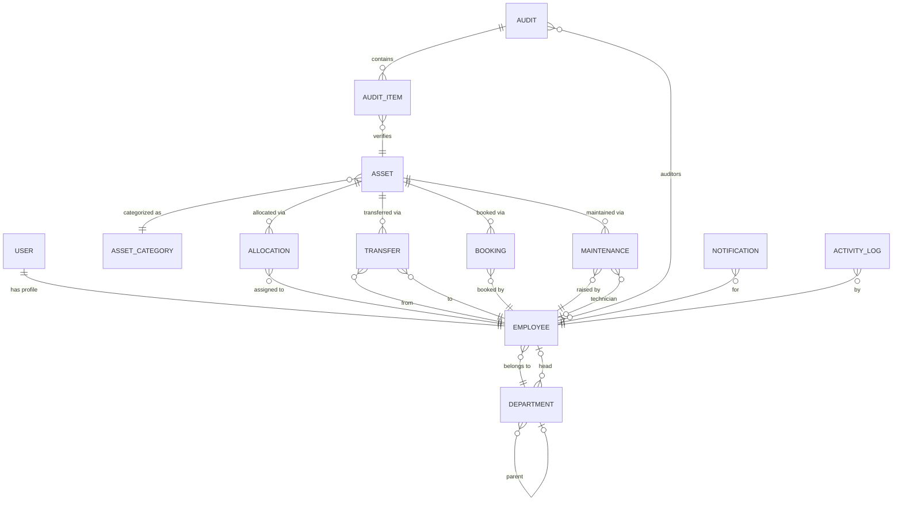
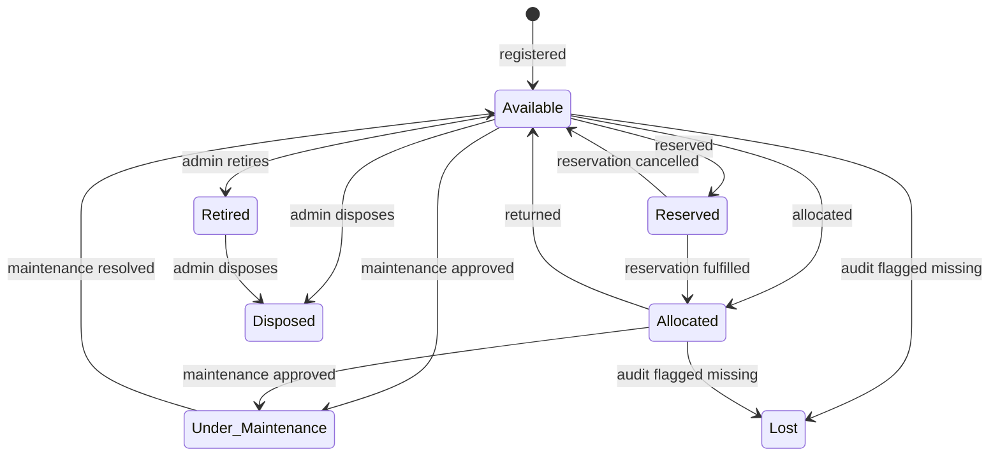

# AssetFlow — FastAPI Backend Implementation Plan

## Problem Summary

Build the backend for **AssetFlow**, an Enterprise Asset & Resource Management System. The system lets organizations track, allocate, and maintain physical assets and shared resources via a centralized platform. Key domains: auth, org setup, asset lifecycle, allocation/transfer, resource booking, maintenance workflows, audits, reports, notifications, and activity logs.

This plan covers **backend only** using **Python + FastAPI**.

---

## Tech Stack

| Layer | Choice | Rationale |
|---|---|---|
| Framework | **FastAPI** | Async, auto-docs (Swagger/ReDoc), Pydantic validation |
| Data Storage | **In-memory dicts** (DB-ready later) | Fast hackathon iteration; swap to SQLAlchemy + PostgreSQL later |
| Auth | **JWT** (python-jose) + **bcrypt** (passlib) | Stateless auth, secure password hashing |
| Validation | **Pydantic v2** | Built into FastAPI, fast, type-safe |
| File Storage | Local filesystem (dev) / S3-compatible (prod) | For asset photos, documents, attachments |
| Task Queue | **None for MVP** (future: Celery/ARQ) | Booking reminders & overdue checks can be cron-based initially |
| Testing | **pytest** + **httpx** (AsyncClient) | Standard FastAPI testing stack |

> [!NOTE]
> **Database excluded for now.** The architecture uses in-memory dict-based stores behind a clean service layer. When ready to integrate a database (PostgreSQL + SQLAlchemy 2.0 + Alembic), you only need to add a `repositories/` layer and swap the service implementations — no router or schema changes needed.

---

## Project Structure

```
backend/
├── app/
│   ├── __init__.py
│   ├── main.py                 # FastAPI app entry point
│   ├── config.py               # Settings via pydantic-settings
│   │
│   ├── models/                 # Pydantic data models (not ORM)
│   │   ├── __init__.py
│   │   ├── user.py             # User (login credentials)
│   │   ├── employee.py         # Employee profile
│   │   ├── department.py
│   │   ├── asset_category.py
│   │   ├── asset.py
│   │   ├── allocation.py
│   │   ├── transfer.py
│   │   ├── booking.py
│   │   ├── maintenance.py
│   │   ├── audit.py
│   │   ├── notification.py
│   │   └── activity_log.py
│   │
│   ├── store/                  # In-memory data stores
│   │   ├── __init__.py
│   │   └── memory_store.py     # Dict-based storage for all entities
│   │
│   ├── schemas/                # Pydantic request/response schemas
│   │   ├── __init__.py
│   │   ├── auth.py
│   │   ├── employee.py
│   │   ├── department.py
│   │   ├── asset_category.py
│   │   ├── asset.py
│   │   ├── allocation.py
│   │   ├── transfer.py
│   │   ├── booking.py
│   │   ├── maintenance.py
│   │   ├── audit.py
│   │   ├── notification.py
│   │   ├── activity_log.py
│   │   └── dashboard.py
│   │
│   ├── routers/                # FastAPI APIRouters (controller layer)
│   │   ├── __init__.py
│   │   ├── auth.py
│   │   ├── dashboard.py
│   │   ├── departments.py
│   │   ├── categories.py
│   │   ├── employees.py
│   │   ├── assets.py
│   │   ├── allocations.py
│   │   ├── transfers.py
│   │   ├── bookings.py
│   │   ├── maintenance.py
│   │   ├── audits.py
│   │   ├── reports.py
│   │   ├── notifications.py
│   │   └── activity_logs.py
│   │
│   ├── services/               # Business logic layer
│   │   ├── __init__.py
│   │   ├── auth_service.py
│   │   ├── department_service.py
│   │   ├── employee_service.py
│   │   ├── asset_service.py
│   │   ├── allocation_service.py
│   │   ├── transfer_service.py
│   │   ├── booking_service.py
│   │   ├── maintenance_service.py
│   │   ├── audit_service.py
│   │   ├── dashboard_service.py
│   │   ├── report_service.py
│   │   ├── notification_service.py
│   │   └── activity_log_service.py
│   │
│   ├── middleware/
│   │   ├── __init__.py
│   │   └── request_logger.py   # Log every request for activity tracking
│   │
│   ├── dependencies/           # FastAPI Depends() functions
│   │   ├── __init__.py
│   │   └── auth.py             # get_current_user, require_role()
│   │
│   ├── utils/
│   │   ├── __init__.py
│   │   ├── security.py         # JWT encode/decode, password hashing
│   │   ├── asset_tag.py        # Auto-generate AF-XXXX tags
│   │   ├── qr_generator.py     # QR code generation
│   │   └── exceptions.py       # Custom HTTP exceptions
│   │
│   └── uploads/                # Local file upload directory (dev)
│
├── tests/
│   ├── conftest.py
│   ├── test_auth.py
│   ├── test_assets.py
│   ├── test_allocations.py
│   ├── test_bookings.py
│   └── ...
│
├── requirements.txt
├── .env.example
└── README.md
```

---

## Database Schema (Key Models)

### Entity Relationship Overview



### Model Details

#### User
| Column | Type | Notes |
|---|---|---|
| id | UUID (PK) | |
| email | String (unique) | Login credential |
| hashed_password | String | bcrypt |
| is_active | Boolean | Default true |
| created_at | DateTime | |
| updated_at | DateTime | |

#### Employee
| Column | Type | Notes |
|---|---|---|
| id | UUID (PK) | |
| user_id | FK → User | One-to-one |
| name | String | |
| email | String | Display email |
| department_id | FK → Department | Nullable |
| role | Enum | `employee`, `department_head`, `asset_manager`, `admin` |
| status | Enum | `active`, `inactive` |
| created_at | DateTime | |

#### Department
| Column | Type | Notes |
|---|---|---|
| id | UUID (PK) | |
| name | String | |
| head_id | FK → Employee | Nullable |
| parent_id | FK → Department | Self-referential, nullable |
| status | Enum | `active`, `inactive` |
| created_at | DateTime | |

#### AssetCategory
| Column | Type | Notes |
|---|---|---|
| id | UUID (PK) | |
| name | String | e.g. Electronics, Furniture |
| custom_fields | JSON | Optional category-specific fields |
| created_at | DateTime | |

#### Asset
| Column | Type | Notes |
|---|---|---|
| id | UUID (PK) | |
| name | String | |
| asset_tag | String (unique) | Auto-generated `AF-XXXX` |
| serial_number | String | Nullable |
| category_id | FK → AssetCategory | |
| acquisition_date | Date | |
| acquisition_cost | Decimal | For reports only |
| condition | String | e.g. New, Good, Fair, Poor |
| location | String | |
| status | Enum | `available`, `allocated`, `reserved`, `under_maintenance`, `lost`, `retired`, `disposed` |
| is_bookable | Boolean | Shared/bookable flag |
| photo_url | String | Nullable |
| documents | JSON | Array of file paths |
| created_at | DateTime | |

#### Allocation
| Column | Type | Notes |
|---|---|---|
| id | UUID (PK) | |
| asset_id | FK → Asset | |
| employee_id | FK → Employee | |
| department_id | FK → Department | Nullable (allocate to dept) |
| allocated_at | DateTime | |
| expected_return_date | Date | Nullable |
| actual_return_date | DateTime | Nullable (filled on return) |
| return_condition | String | Nullable |
| return_notes | Text | Nullable |
| is_active | Boolean | |
| created_at | DateTime | |

#### Transfer
| Column | Type | Notes |
|---|---|---|
| id | UUID (PK) | |
| asset_id | FK → Asset | |
| from_employee_id | FK → Employee | |
| to_employee_id | FK → Employee | |
| status | Enum | `requested`, `approved`, `rejected`, `completed`, `cancelled` |
| requested_by_id | FK → Employee | |
| approved_by_id | FK → Employee | Nullable |
| reason | Text | |
| created_at | DateTime | |
| resolved_at | DateTime | Nullable |

#### Booking
| Column | Type | Notes |
|---|---|---|
| id | UUID (PK) | |
| asset_id | FK → Asset | Must be bookable |
| booked_by_id | FK → Employee | |
| start_time | DateTime | |
| end_time | DateTime | |
| status | Enum | `upcoming`, `ongoing`, `completed`, `cancelled` |
| purpose | Text | Nullable |
| created_at | DateTime | |

#### Maintenance
| Column | Type | Notes |
|---|---|---|
| id | UUID (PK) | |
| asset_id | FK → Asset | |
| raised_by_id | FK → Employee | |
| description | Text | |
| priority | Enum | `low`, `medium`, `high`, `critical` |
| status | Enum | `pending`, `approved`, `rejected`, `assigned`, `in_progress`, `resolved` |
| approved_by_id | FK → Employee | Nullable |
| technician_id | FK → Employee | Nullable |
| resolution_notes | Text | Nullable |
| photo_url | String | Nullable |
| created_at | DateTime | |
| resolved_at | DateTime | Nullable |

#### Audit / AuditItem
| Column | Type | Notes |
|---|---|---|
| **Audit** | | |
| id | UUID (PK) | |
| name | String | Cycle name |
| scope_type | Enum | `department`, `location` |
| scope_value | String | Dept ID or location name |
| start_date | Date | |
| end_date | Date | |
| status | Enum | `open`, `in_progress`, `closed` |
| created_by_id | FK → Employee | |
| created_at | DateTime | |
| closed_at | DateTime | Nullable |
| **AuditItem** | | |
| id | UUID (PK) | |
| audit_id | FK → Audit | |
| asset_id | FK → Asset | |
| auditor_id | FK → Employee | |
| result | Enum | `pending`, `verified`, `missing`, `damaged` |
| notes | Text | Nullable |
| verified_at | DateTime | Nullable |

#### Notification
| Column | Type | Notes |
|---|---|---|
| id | UUID (PK) | |
| employee_id | FK → Employee | |
| title | String | |
| message | Text | |
| type | String | e.g. `asset_assigned`, `maintenance_approved`, `overdue_return` |
| is_read | Boolean | Default false |
| reference_id | UUID | Nullable, generic FK to related entity |
| reference_type | String | e.g. `allocation`, `maintenance`, `booking` |
| created_at | DateTime | |

#### ActivityLog
| Column | Type | Notes |
|---|---|---|
| id | UUID (PK) | |
| employee_id | FK → Employee | |
| action | String | e.g. `asset_created`, `allocation_returned` |
| module | String | e.g. `assets`, `allocations` |
| entity_id | UUID | Nullable |
| entity_type | String | |
| details | JSON | Extra metadata |
| created_at | DateTime | |

---

## API Endpoints (FastAPI Routers)

All endpoints are prefixed with `/api/v1`. Each router maps directly to your roadmap.

### 1. Auth (`/api/v1/auth`)

| Method | Path | Auth | Role | Description |
|---|---|---|---|---|
| POST | `/signup` | ❌ | — | Create Employee account (role=employee) |
| POST | `/login` | ❌ | — | Returns JWT access + refresh token |
| POST | `/logout` | ✅ | Any | Invalidate session (token blocklist) |
| POST | `/forgot-password` | ❌ | — | Send reset link (email) |
| POST | `/reset-password` | ❌ | — | Reset with token |
| GET | `/me` | ✅ | Any | Current user + employee profile |

### 2. Dashboard (`/api/v1/dashboard`)

| Method | Path | Auth | Role | Description |
|---|---|---|---|---|
| GET | `/` | ✅ | Any | KPI cards: available, allocated, maintenance today, active bookings, pending transfers, upcoming/overdue returns |

### 3. Organization — Departments (`/api/v1/departments`)

| Method | Path | Auth | Role | Description |
|---|---|---|---|---|
| GET | `/` | ✅ | Any | List all departments |
| GET | `/{id}` | ✅ | Any | Department detail |
| POST | `/` | ✅ | Admin | Create department |
| PATCH | `/{id}` | ✅ | Admin | Update department |
| PATCH | `/{id}/deactivate` | ✅ | Admin | Soft-deactivate |

### 4. Organization — Categories (`/api/v1/categories`)

| Method | Path | Auth | Role | Description |
|---|---|---|---|---|
| GET | `/` | ✅ | Any | List categories |
| POST | `/` | ✅ | Admin | Create category |
| PATCH | `/{id}` | ✅ | Admin | Update category |
| DELETE | `/{id}` | ✅ | Admin | Delete category (only if no assets linked) |

### 5. Organization — Employees (`/api/v1/employees`)

| Method | Path | Auth | Role | Description |
|---|---|---|---|---|
| GET | `/` | ✅ | Admin, Manager | List employees (filterable) |
| GET | `/{id}` | ✅ | Any | Employee detail |
| PATCH | `/{id}` | ✅ | Admin | Update employee info |
| PATCH | `/{id}/role` | ✅ | Admin | Promote/change role |
| PATCH | `/{id}/status` | ✅ | Admin | Activate/deactivate |

### 6. Assets (`/api/v1/assets`)

| Method | Path | Auth | Role | Description |
|---|---|---|---|---|
| GET | `/` | ✅ | Any | List/search assets (query params: tag, serial, category, department, location, status) |
| GET | `/{id}` | ✅ | Any | Asset detail |
| POST | `/` | ✅ | Asset Manager | Register new asset (auto-generates tag) |
| PATCH | `/{id}` | ✅ | Asset Manager | Update asset |
| DELETE | `/{id}` | ✅ | Admin | Soft-delete (mark Disposed) |
| GET | `/{id}/history` | ✅ | Any | Allocation + maintenance history |
| GET | `/{id}/qrcode` | ✅ | Any | Generate QR code image |

### 7. Allocations (`/api/v1/allocations`)

| Method | Path | Auth | Role | Description |
|---|---|---|---|---|
| GET | `/` | ✅ | Any | List allocations (filter: active, employee, department) |
| GET | `/{id}` | ✅ | Any | Allocation detail |
| POST | `/` | ✅ | Asset Manager, Dept Head | Allocate asset (conflict check) |
| PATCH | `/{id}/return` | ✅ | Asset Manager | Return asset, capture condition + notes |
| GET | `/overdue` | ✅ | Manager+ | Overdue allocations |

### 8. Transfers (`/api/v1/transfers`)

| Method | Path | Auth | Role | Description |
|---|---|---|---|---|
| GET | `/` | ✅ | Any | List transfers |
| GET | `/{id}` | ✅ | Any | Transfer detail |
| POST | `/` | ✅ | Any | Request transfer |
| PATCH | `/{id}/approve` | ✅ | Manager, Dept Head | Approve transfer → execute re-allocation |
| PATCH | `/{id}/reject` | ✅ | Manager, Dept Head | Reject transfer |
| PATCH | `/{id}/cancel` | ✅ | Requester | Cancel own request |

### 9. Bookings (`/api/v1/bookings`)

| Method | Path | Auth | Role | Description |
|---|---|---|---|---|
| GET | `/` | ✅ | Any | List bookings |
| GET | `/{id}` | ✅ | Any | Booking detail |
| POST | `/` | ✅ | Any | Create booking (overlap validation) |
| PATCH | `/{id}` | ✅ | Booker | Reschedule (re-validate overlaps) |
| DELETE | `/{id}` | ✅ | Booker | Cancel booking |
| GET | `/calendar` | ✅ | Any | Calendar view (query: resource_id, month) |
| GET | `/availability` | ✅ | Any | Check slot availability |

### 10. Maintenance (`/api/v1/maintenance`)

| Method | Path | Auth | Role | Description |
|---|---|---|---|---|
| GET | `/` | ✅ | Any | List requests |
| GET | `/{id}` | ✅ | Any | Request detail |
| POST | `/` | ✅ | Any | Raise maintenance request |
| PATCH | `/{id}/approve` | ✅ | Asset Manager | Approve → asset status = under_maintenance |
| PATCH | `/{id}/reject` | ✅ | Asset Manager | Reject request |
| PATCH | `/{id}/assign` | ✅ | Asset Manager | Assign technician |
| PATCH | `/{id}/start` | ✅ | Technician | Mark in-progress |
| PATCH | `/{id}/resolve` | ✅ | Technician | Resolve → asset status = available |

### 11. Audits (`/api/v1/audits`)

| Method | Path | Auth | Role | Description |
|---|---|---|---|---|
| GET | `/` | ✅ | Admin, Manager | List audit cycles |
| GET | `/{id}` | ✅ | Admin, Manager | Audit detail |
| POST | `/` | ✅ | Admin | Create audit cycle + assign auditors |
| PATCH | `/{id}` | ✅ | Admin | Update cycle metadata |
| PATCH | `/{id}/close` | ✅ | Admin | Close cycle → lock, update asset statuses |
| POST | `/{id}/items` | ✅ | Auditor | Submit verification result for an asset |
| PATCH | `/{id}/items/{item_id}` | ✅ | Auditor | Update verification result |
| GET | `/{id}/report` | ✅ | Admin, Manager | Auto-generated discrepancy report |

### 12. Reports (`/api/v1/reports`)

| Method | Path | Auth | Role | Description |
|---|---|---|---|---|
| GET | `/utilization` | ✅ | Manager+ | Asset utilization trends |
| GET | `/maintenance` | ✅ | Manager+ | Maintenance frequency by asset/category |
| GET | `/departments` | ✅ | Manager+ | Department-wise allocation summary |
| GET | `/bookings` | ✅ | Manager+ | Booking heatmap data |
| GET | `/retirement` | ✅ | Manager+ | Assets nearing retirement |
| GET | `/export` | ✅ | Manager+ | Export report as CSV/PDF |

### 13. Notifications (`/api/v1/notifications`)

| Method | Path | Auth | Role | Description |
|---|---|---|---|---|
| GET | `/` | ✅ | Any | User's notifications |
| PATCH | `/{id}/read` | ✅ | Owner | Mark as read |
| PATCH | `/read-all` | ✅ | Owner | Mark all as read |
| DELETE | `/{id}` | ✅ | Owner | Delete notification |

### 14. Activity Logs (`/api/v1/activity`)

| Method | Path | Auth | Role | Description |
|---|---|---|---|---|
| GET | `/` | ✅ | Admin | List logs (filter: user, module, date, action) |
| GET | `/{id}` | ✅ | Admin | Log detail |

---

## Key Business Rules (Enforced in Services)

### Asset Status State Machine



### Allocation Rules
- Asset **must** be `available` to allocate
- **One active allocation per asset** — if already allocated, block and show current holder + offer transfer request
- Return sets asset status back to `available`
- Overdue allocations (past `expected_return_date`) auto-flagged, feed dashboard + notifications

### Transfer Rules
- Asset **must** already be allocated to someone
- Approval required from Asset Manager or Department Head before re-allocation
- On approval: previous allocation closes automatically, new allocation created, history updated

### Booking Rules
- Asset must have `is_bookable = true`
- **No overlapping time slots** for the same resource — validate `start_time < existing_end_time AND end_time > existing_start_time`
- Cancelled bookings free the slot immediately
- Booking status auto-transitions: `upcoming` → `ongoing` → `completed`

### Maintenance Rules
- Approval required before work begins
- On approval: asset status → `under_maintenance`
- On resolution: asset status → `available`
- Full maintenance history preserved per asset

### Audit Rules
- Audit cycles are **immutable after closure** (locked)
- Assets marked `missing` during audit → status becomes `lost`
- Discrepancy report auto-generated from flagged items

---

## Auth & Security Design

### JWT Flow
1. **Signup** → creates `User` + `Employee` (role = `employee`) → no role self-selection
2. **Login** → validates credentials → returns `access_token` (short-lived, 30min) + `refresh_token` (long-lived, 7d)
3. **Protected routes** → `Authorization: Bearer <token>` → `get_current_user` dependency decodes JWT, loads employee
4. **Role checks** → `require_role(["admin", "asset_manager"])` dependency ensures role authorization

### Role Promotion
- Only via `PATCH /employees/{id}/role` by Admin
- No role selection at signup — this is critical per the PS

### Password Security
- bcrypt hashing via `passlib`
- Forgot password → generates time-limited reset token → sent via email (or returned in dev mode)

---

## Cross-Cutting Concerns

### Notification Generation
Every business action that matters triggers a notification:
- **AllocationService** → `asset_assigned`, `overdue_return`
- **TransferService** → `transfer_requested`, `transfer_approved`, `transfer_rejected`
- **MaintenanceService** → `maintenance_approved`, `maintenance_rejected`, `maintenance_resolved`
- **BookingService** → `booking_confirmed`, `booking_cancelled`, `booking_reminder`
- **AuditService** → `audit_discrepancy_flagged`

### Activity Logging
The `ActivityLogService.log_action()` is called from every service method to record who did what and when. Middleware can also auto-log requests.

### Error Handling
- Custom exception classes in `utils/exceptions.py` (e.g. `AssetNotAvailableError`, `BookingOverlapError`, `TransferNotAllowedError`)
- Global exception handler middleware converts these to proper HTTP responses with structured error bodies

### Pagination
- All list endpoints support `?page=1&page_size=20` with consistent response format:
  ```json
  { "items": [...], "total": 100, "page": 1, "page_size": 20, "pages": 5 }
  ```

---

## Proposed Changes

### Backend Foundation

#### [NEW] [requirements.txt](file:///e:/Coding/Hackthon_Projects/Odoo-Hackthon-2026/backend/requirements.txt)
Core dependencies: `fastapi`, `uvicorn[standard]`, `sqlalchemy[asyncio]`, `asyncpg`, `alembic`, `pydantic-settings`, `python-jose[cryptography]`, `passlib[bcrypt]`, `python-multipart`, `qrcode[pil]`, `httpx`, `pytest`, `pytest-asyncio`.

#### [NEW] [.env.example](file:///e:/Coding/Hackthon_Projects/Odoo-Hackthon-2026/backend/.env.example)
Template for environment variables: `SECRET_KEY`, `ACCESS_TOKEN_EXPIRE_MINUTES`, `REFRESH_TOKEN_EXPIRE_DAYS`, etc.

#### [NEW] [main.py](file:///e:/Coding/Hackthon_Projects/Odoo-Hackthon-2026/backend/app/main.py)
FastAPI app initialization, CORS middleware, router inclusion, global exception handlers.

#### [NEW] [config.py](file:///e:/Coding/Hackthon_Projects/Odoo-Hackthon-2026/backend/app/config.py)
`pydantic-settings` based configuration loading from `.env`.

---

### Models Layer (12 files)
Pydantic `BaseModel` classes defining the data shape of each entity. These are **not** ORM models — they're pure data classes used by the in-memory store and as the basis for schemas.

### Schemas Layer (13 files)
Pydantic v2 schemas for request validation and response serialization. `Create`/`Update`/`Response` variants per entity.

### Store Layer (1 file)
`store/memory_store.py` — A singleton `MemoryStore` class with typed dicts for each entity (`Dict[UUID, Model]`). Provides basic CRUD helpers. Designed to be swappable with a repository/DB layer later.

### Services Layer (13 files)
Business logic, state machine enforcement, conflict validation, notification triggering, activity logging. Services read/write from the in-memory store.

### Routers Layer (14 files)
Thin controller layer — parse request, call service, return response. Role-based access via `Depends(require_role(...))`.

### Dependencies & Middleware
- `dependencies/auth.py` — `get_current_user`, `require_role`
- `middleware/request_logger.py` — auto-log all API requests

### Utilities
- `utils/security.py` — JWT + bcrypt helpers
- `utils/asset_tag.py` — Auto-increment `AF-XXXX` tag generator
- `utils/qr_generator.py` — QR code generation for assets
- `utils/exceptions.py` — Custom exception classes

---

## Development Order (Aligned with Roadmap Priority)

### Phase 1 — Foundation (Must Have)
1. Project setup: `requirements.txt`, `.env`, `config.py`, `main.py`
2. Pydantic data models + in-memory store
3. Auth module (signup, login, JWT, me)
4. Dependencies & middleware (auth, role-check)
5. Organization module (departments, categories, employees, role promotion)
6. Asset CRUD + search + auto-tag generation
7. Allocation module (allocate, return, conflict blocking, overdue detection)
8. Transfer workflow (request → approve/reject → re-allocate)
9. Maintenance workflow (raise → approve → assign → start → resolve)
10. Dashboard KPIs

### Phase 2 — Should Have
11. Resource booking (create, overlap validation, calendar, availability)
12. Notifications (creation from all services, list, mark read)
13. Reports (utilization, maintenance, department, booking heatmap)

### Phase 3 — Nice to Have
14. QR code generation
15. Audit cycles (create, assign auditors, verify, close, discrepancy report)
16. Activity logs (full audit trail)
17. Report export (CSV/PDF)

### Phase 4 — Database Integration (Post-Hackathon)
18. Add PostgreSQL + SQLAlchemy 2.0 + Alembic
19. Create ORM models from existing Pydantic data models
20. Add `repositories/` layer with async DB queries
21. Swap service layer to use repositories instead of in-memory store

---

## Verification Plan

### Automated Tests
```bash
cd backend
pytest tests/ -v --asyncio-mode=auto
```
- Unit tests for each service (business rule enforcement)
- Integration tests for each router (end-to-end API flow)
- Specific tests for conflict scenarios: double allocation, booking overlap, invalid state transitions

### Manual Verification
- Swagger UI at `http://localhost:8000/docs` — test all endpoints interactively
- Verify role-based access: signup as employee → try admin endpoints → expect 403
- Verify asset state machine: allocate → try re-allocate → expect conflict error
- Verify booking overlap: book 9:00–10:00 → try 9:30–10:30 → expect rejection

> [!IMPORTANT]
> **Email for forgot-password**: Should we implement actual email sending (needs SMTP config) or just return the reset token in the API response for hackathon purposes?

> [!IMPORTANT]
> **File uploads**: For asset photos/documents — should we implement local filesystem storage for now, or skip file uploads entirely and just store URL strings?
